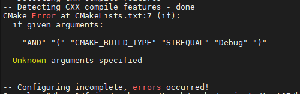

# cmake学习笔记

<!-- TOC -->

- [cmake学习笔记](#cmake学习笔记)
  - [1. 常见语法](#1-常见语法)
    - [1.1. 控制逻辑: if-else](#11-控制逻辑-if-else)
      - [1.1.1. if-else的语法以及注意事项](#111-if-else的语法以及注意事项)
      - [1.1.2. 如何设置if-else中的条件变量](#112-如何设置if-else中的条件变量)
    - [1.2. project语句](#12-project语句)
      - [1.2.1. project语法与作用](#121-project语法与作用)
      - [1.2.2. project命令解析](#122-project命令解析)
        - [1.2.2.1. project-指定工程名称](#1221-project-指定工程名称)
        - [1.2.2.2. project-指定工程的版本号](#1222-project-指定工程的版本号)
        - [1.2.2.3. project-对工程的文本描述](#1223-project-对工程的文本描述)
        - [1.2.2.4. project-指定工程的主页URL](#1224-project-指定工程的主页url)
        - [1.2.2.5. project-选择构建工程需要的编程语言](#1225-project-选择构建工程需要的编程语言)
      - [1.2.3. project命令的更多细节](#123-project命令的更多细节)
    - [1.3. cmake_minimum_required语句](#13-cmake_minimum_required语句)
      - [1.3.1. cmake_minimum_required语法与作用](#131-cmake_minimum_required语法与作用)
      - [1.3.2. cmake_minimum_required的更多细节](#132-cmake_minimum_required的更多细节)
    - [1.4. 定义宏](#14-定义宏)
  - [2. 使用样例](#2-使用样例)
    - [2.1. cmake中使用protobuf/protobuf-c命令来编译.proto文件](#21-cmake中使用protobufprotobuf-c命令来编译proto文件)
      - [2.1.1. 能正常运行的cmake代码](#211-能正常运行的cmake代码)
      - [2.1.2. 参考的文档: CMake 中使用 protobuf/protobuf-c](#212-参考的文档-cmake-中使用-protobufprotobuf-c)
    - [2.2. cmake生成compile_commands.json](#22-cmake生成compile_commandsjson)
  - [3. Q&A](#3-qa)
    - [3.1. add_custom_command 不执行](#31-add_custom_command-不执行)

<!-- /TOC -->

## 1. 常见语法

### 1.1. 控制逻辑: if-else

#### 1.1.1. if-else的语法以及注意事项

语法：

```cmake
if(<condition>)
  <commands>
elseif(<condition>) # optional block, can be repeated
  <commands>
else()              # optional block
  <commands>
endif()
```

样例：

```cmake
cmake_minimum_required(VERSION 3.12)
project(test07)

aux_source_directory(${PROJECT_SOURCE_DIR}/src src_dirs)

# 条件判断
if(CMAKE_BUILD_TYPE AND (CMAKE_BUILD_TYPE STREQUAL "Debug"))
    set(CMAKE_C_FLAGS_DEBUG "${CMAKE_C_FLAGS_DEBUG} -Wall -O0")
    message("Debug mode:${CMAKE_C_FLAGS_DEBUG}")
    add_executable(test_debug ${src_dirs})

elseif(CMAKE_BUILD_TYPE AND (CMAKE_BUILD_TYPE STREQUAL "Release"))
    set(CMAKE_C_FLAGS_RELEASE "${CMAKE_C_FLAGS_RELEASE} -Wall -O3")
    message("Release mode:${CMAKE_C_FLAGS_RELEASE}")
    add_executable(test_release ${src_dirs})
else()
    message("else:${CMAKE_BUILD_TYPE}")
    message("else:${CMAKE_C_FLAGS_RELEASE}")
    add_executable(test_release ${src_dirs})
endif()
```

if条件命名的语法非常简单。这里需要特别说明关于 `if(<variable>)` 中 variable 的注意点，引用文档中的一段话：

> The if command was written very early in CMake’s history, predating the ${} variable evaluation syntax, and for convenience evaluates variables named by its arguments as shown in the above signatures. Note that normal variable evaluation with ${} applies before the if command even receives the arguments.
>
> 这段话的意思是，由于 if 命令语法在变量引用 \${} 语法之前出现，所以如果使用 if(\${var})，那么将会被引用两次；如果使用 if(var)，将只会被if本身的语法引用一次。也就是要注意两次引用问题。

如果将变量 CMAKE_BUILD_TYPE 通过 \${} 再引用一次，会发生什么?

```cmake
if(${CMAKE_BUILD_TYPE} AND (CMAKE_BUILD_TYPE STREQUAL "Debug"))
# 由于 ${CMAKE_BUILD_TYPE}的值为空，if(${CMAKE_BUILD_TYPE}相当于if(空变量)，然后if命令再对"空变量"进行引用，显然，语法上错误。即会报如下图错误：
```



**如果你非要使用 `if($var)`，那你必须明确的知道变量 var 的值是另一个变量的变量名。**

如(没有什么实际意义，仅作为解释语法特点)：

```cmake
cmake_minimum_required(VERSION 3.12)
project(test07)

aux_source_directory(${PROJECT_SOURCE_DIR}/src src_dirs)

set(mode "CMAKE_BUILD_TYPE") # 修改点

# 条件判断
if(${mode} AND (CMAKE_BUILD_TYPE STREQUAL "Debug")) # 修改点
    set(CMAKE_C_FLAGS_DEBUG "${CMAKE_C_FLAGS_DEBUG} -Wall -O0")
    message("Debug mode:${CMAKE_C_FLAGS_DEBUG}")
    add_executable(test_debug ${src_dirs})

elseif(${mode} AND (CMAKE_BUILD_TYPE STREQUAL "Release")) # 修改点
    set(CMAKE_C_FLAGS_RELEASE "${CMAKE_C_FLAGS_RELEASE} -Wall -O3")
    message("Release mode:${CMAKE_C_FLAGS_RELEASE}")
    add_executable(test_release ${src_dirs})
else()
    message("else:${CMAKE_BUILD_TYPE}")
    message("else:${CMAKE_C_FLAGS_RELEASE}")
    add_executable(test_release ${src_dirs})
endif()
```

#### 1.1.2. 如何设置if-else中的条件变量

可以在 cmake 的时候通过 `-D` 选项设置 cmake 中出现的变量，如：

```cmake
# 在前面的CMakeLists.txt中
if(CMAKE_BUILD_TYPE AND (CMAKE_BUILD_TYPE STREQUAL "Debug"))

# 如果是通过cmake .. 编译，而没有指定CMAKE_BUILD_TYPE的话，那么if命令本身会引用变量CMAKE_BUILD_TYPE，其值为空，if条件判断为假；
# 如果是通过cmake -DCMAKE_BUILD_TYPE=Debug .. 编译，if命令本身会引用变量CMAKE_BUILD_TYPE，其值为Debug，if条件判断为真；
```

### 1.2. project语句

[//]:参考链接：
[//]:https://www.jianshu.com/p/cdd6e56c2422
[//]:https://cmake.org/cmake/help/latest/command/project.html
[//]:https://cmake.org/cmake/help/latest/variable/CMAKE_PROJECT_NAME.html#variable:CMAKE_PROJECT_NAME
[//]:https://cmake.org/cmake/help/latest/variable/CMAKE_PROJECT_VERSION.html#variable:CMAKE_PROJECT_VERSION

#### 1.2.1. project语法与作用

语法格式：

```cmake
project(<PROJECT-NAME> [<language-name>...])
或
project(<PROJECT-NAME>
[VERSION <major>[.<minor>[.<patch>[.<tweak>]]]]
[DESCRIPTION <project-description-string>]
[HOMEPAGE_URL <url-string>]
[LANGUAGES <language-name>...])
```

作用：**指定 cmake 工程的名称、版本号(`VERSION` 关键字)、简短的描述(`DESCRIPTION` 关键字)、主页URL(`HOMEPAGE_URL` 关键字) 以及编译工程使用的语言(`LANGUAGES` 关键字)**

#### 1.2.2. project命令解析

##### 1.2.2.1. project-指定工程名称

```cmake
# CMakeLists.txt
cmake_minimum_required (VERSION 3.10.2)
project (mytest)
```

这样就指定了当前的工程名称为 *mytest*。实际上在调用 `project` 命令指定当前工程名字的同时，cmake 内部会为如下变量赋值：

- `PROJECT_NAME`: 将当前工程名称赋值给 `PROJECT_NAME`，对于上述例子 `${PROJECT_NAME}=mytest`
- `PROJECT_SOURCE_DIR`: 当前工程的源码路径
- `<PROJECT-NAME>_SOURCE_DIR`: 指定工程的源码路径，这个变量和 `PROJECT_SOURCE_DIR` 的区别就是: `<PROJECT-NAME>_SOURCE_DIR` 跟具体的工程名字关联起来，若 `<PROJECT-NAME>` 就是当前工程，则该变量和PROJECT_SOURCE_DIR相等
- `PROJECT_BINARY_DIR` 当前工程的二进制路径
- `<PROJECT-NAME>_BINARY_DIR`：指定工程的二进制路径，这个变量和 `PROJECT_BINARY_DIR` 的区别就是，`<PROJECT-NAME>_BINARY_DIR` 跟具体的工程名字关联起来，若 `<PROJECT-NAME>` 就是当前工程，则该变量和 `PROJECT_BINARY_DIR` 相等。
- `CMAKE_PROJECT_NAME`：顶层工程的名称。例如当前调用的 CMakeLists.txt 位于顶层目录（可以理解为使用 cmake 命令首次调用的那个CMakeLists.txt），那么工程名还会赋值给 `CMAKE_PROJECT_NAME`。

样例：

```cmake
# test/CMakeLists.txt
cmake_minimum_required (VERSION 3.10.2)
set (TOP_PROJECT_NAME "mytest") # 定义了变量TOP_PROJECT_NAME为"mytest"
project (${TOP_PROJECT_NAME}) 

message (">>> top PROJECT_NAME: ${PROJECT_NAME}")
message (">>> top PROJECT_SOURCE_DIR: ${PROJECT_SOURCE_DIR}")
message (">>> top <PROJECT_NAME>_SOURCE_DIR: ${${TOP_PROJECT_NAME}_SOURCE_DIR}") 
message (">>> top PROJECT_BINARY_DIR: ${PROJECT_BINARY_DIR}")
message (">>> top <PROJECT_NAME>_BINARY_DIR: ${${TOP_PROJECT_NAME}_BINARY_DIR}")
message (">>> top CMAKE_PROJECT_NAME: ${CMAKE_PROJECT_NAME}")

add_subdirectory (sub_test) # 调用sub_test下的CMakeList.txt进行构建

#############################################################################
# test/sub_test/CMakeLists.txt
cmake_minimum_required (VERSION 3.10.2)
set (SUB_LEVEL_PROJECT_NAME "mysubtest") # 定义了变量SUB_LEVEL_PROJECT_NAME为"mysubtest"
project (${SUB_LEVEL_PROJECT_NAME}) 

message (">>>>>> sub PROJECT_NAME: ${PROJECT_NAME}")
message (">>>>>> sub PROJECT_SOURCE_DIR: ${PROJECT_SOURCE_DIR}")
message (">>>>>> sub <PROJECT_NAME>_SOURCE_DIR: ${${SUB_LEVEL_PROJECT_NAME}_SOURCE_DIR}") 
message (">>>>>> sub <PROJECT_NAME>_SOURCE_DIR(top level): ${${TOP_PROJECT_NAME}_SOURCE_DIR}") 
message (">>>>>> sub PROJECT_BINARY_DIR: ${PROJECT_BINARY_DIR}")
message (">>>>>> sub <PROJECT_NAME>_BINARY_DIR: ${${SUB_LEVEL_PROJECT_NAME}_BINARY_DIR}")
message (">>>>>> sub <PROJECT_NAME>_BINARY_DIR(top level): ${${TOP_PROJECT_NAME}_BINARY_DIR}")
message (">>>>>> sub CMAKE_PROJECT_NAME: ${CMAKE_PROJECT_NAME}")
```

执行结果：

```txt
>>> top PROJECT_NAME: mytest
>>> top PROJECT_SOURCE_DIR: test/
>>> top <PROJECT_NAME>_SOURCE_DIR: test/
>>> top PROJECT_BINARY_DIR: test/ 
>>> top <PROJECT_NAME>_BINARY_DIR: test/
>>> top CMAKE_PROJECT_NAME: mytest
>>>>>> sub PROJECT_NAME: mysubtest
>>>>>> sub PROJECT_SOURCE_DIR: test/sub_test
>>>>>> sub <PROJECT_NAME>_SOURCE_DIR: test/sub_test
>>>>>> sub <PROJECT_NAME>_SOURCE_DIR(top level): test/
>>>>>> sub PROJECT_BINARY_DIR: test/sub_test
>>>>>> sub <PROJECT_NAME>_BINARY_DIR: test/sub_test
>>>>>> sub <PROJECT_NAME>_BINARY_DIR(top level): test/
>>>>>> sub CMAKE_PROJECT_NAME: mytest
```

> 注：因此可以看成带 CMAKE 前缀的变量只属于顶层的 CMakeLists.txt 工程，带 \<PROJECT_NAME\> 为指定（特定）工程名的变量，其余的即为当前正在构建的工程变量，下面在讲到project其他选项时也遵循该规则

##### 1.2.2.2. project-指定工程的版本号

语法格式为：`VERSION <version>`，其中 `<version>` 是由一组由 "." 分隔的，非负整数(最多 4 个数字，最少 1 个数字)组成的字符串，格式为 `<major>[.<minor>[.<patch>[.<tweak>]]]`，如：1.2.3.4。样例如下：

```cmake
# CMakeLists.txt
cmake_minimum_required (VERSION 3.10.2)
project (mytest VERSION 1.2.3.4)
```

同样，当 `project` 命令使用了 `VERSION` 选项，以下变量会被相应地赋值：

- `PROJECT_VERSION`
- `<PROJECT-NAME>_VERSION`
- `PROJECT_VERSION_MAJOR`
- `<PROJECT-NAME>_VERSION_MAJOR`
- `PROJECT_VERSION_MINOR`
- `<PROJECT-NAME>_VERSION_MINOR`
- `PROJECT_VERSION_PATCH`
- `<PROJECT-NAME>_VERSION_PATCH`
- `PROJECT_VERSION_TWEAK`
- `<PROJECT-NAME>_VERSION_TWEAK`
- `CMAKE_PROJECT_VERSION`

上述带 *\<PROJECT_NAME\>* 的变量存储的是指定工程名下版本号，不带的表示当前正在调用的工程的版本号。*XXX_MAJOR、XXX_MINOR、XXX_PATCH、XXX_TWEAK* 分别与点分版本号 `<major>[.<minor>[.<patch>[.<tweak>]]]` 对应。当然，如果 CMakeLists.txt 位于顶层目录，`CMAKE_PROJECT_VERSION` 存储的是顶层 CMakeLists.txt 中 `project` 命令指定的版本号，不会随着调用工程的变化而变化。这些变量的使用与 1 中的工程名变量没什么区别，可以仿照将上述变量打印出来看下，此处就不在赘述。

##### 1.2.2.3. project-对工程的文本描述

语法格式为：`DESCRIPTION <project description string>`，其中 `<project description string>` 是一段描述，不建议太长。样例如下：

```cmake
# CMakeLists.txt
cmake_minimum_required (VERSION 3.10.2)
project (mytest DESCRIPTION “This is mytest project.”)
```

同样调用该选项的会对如下变量赋值，方式与前面的工程名和版本号类似，特别的，当 CMakeLists.txt 位于顶层目录，`CMAKE_PROJECT_DESCRIPTION` 存储的是顶层 CMakeLists.txt 中 `project` 命令指定的工程描述，不会随着调用工程的变化而变化。

- `PROJECT_DESCRIPTION`
- `<PROJECT-NAME>_DESCRIPTION`
- `CMAKE_PROJECT_DESCRIPTION`

##### 1.2.2.4. project-指定工程的主页URL

基本用法如下：

```cmake
# CMakeLists.txt
cmake_minimum_required (VERSION 3.10.2)
project (mytest HOMEPAGE_URL “https://www.XXX(示例).com”)
```

同样调用该选项的会对如下变量赋值，方式与前面的工程名和版本号类似，特别的，当 CMakeLists.txt 位于顶层目录，`CMAKE_PROJECT_HOMEPAGE_URL` 存储的是顶层 CMakeLists.txt 中 `project` 命令指定的工程主页URL，不会随着调用工程的变化而变化。

- `PROJECT_HOMEPAGE_URL`
- `<PROJECT-NAME>_HOMEPAGE_URL`
- `CMAKE_PROJECT_HOMEPAGE_URL`

##### 1.2.2.5. project-选择构建工程需要的编程语言

该选项可以有两种调用方式：

1. 直接跟在工程名后面，可以省略LANGUAGES关键字；
2. 跟在其他关键字（例如VERSION）后面，LANGUAGES关键字不能省略。

```cmake
# 调用方式一
# CMakeLists.txt
cmake_minimum_required (VERSION 3.10.2)
project (mytest “CXX”)

# 调用方式二
# CMakeLists.txt
cmake_minimum_required (VERSION 3.10.2)
project (mytest VERSION 1.2.3.4 LANGUAGES “CXX”)
```

该选项支持的语言包括 C、CXX（例如C++）、CUDA、OBJC（例如Objective-C）、OBJCXX、Fortran、ASM。如果没有指定 LANGUAGES 选项，默认使用的是 C 和 CXX。如果使用LANGUAGES NONE、或仅仅列出LANGUAGES关键字却没有指定具体的语言，那么表示不支持任何语言。如果需要使能 ASM，把它放在列表的最后以便 cmake 能够检查其他语言（例如C语言）能否工作在汇编下。

**该命令的实质是 cmake 会使用 `LANGUAGES` 的语言选项来检查 `CMAKE_XXX_COMPILER` 指定的编译器是否存在，以便工程能正确的被构建。**

#### 1.2.3. project命令的更多细节

1. `project` 命令并非必不可少，如果没有调用 `project` 命令，cmake 仍然会生成一个默认工程名为 "project" 的工程，以及对应的变量（如：`PROJECT_NAME`、`CMAKE_PROJECT`、`PROJECT_SOURCE_DIR`、`<PROJECT-NAME>_SOURCE_DIR`等）。但是 `VERSION`、`DESCRIPTION`、`HOMEPAGE_URL` 等变量不会被赋值。（`LANGUAGES` 除外，即使不指定，默认语言为 C 和 CXX）
2. `project` 命令需要放置在其他命令之前，`cmake_minimum_required` 命令之后（[cmake_minimum_required命令参考](https://www.jianshu.com/p/7535bff0e894)）
3. 如果多次调用 `project` 命令，那么 `CMAKE_PROJECT_NAME`、`CMAKE_PROJECT_VERSION`、`CMAKE_PROJECT_DESCRIPTION`、`CMAKE_PROJECT_HOMEPAGE_URL` 等变量是以最近一次调用的 `project` 命令为准。

### 1.3. cmake_minimum_required语句

#### 1.3.1. cmake_minimum_required语法与作用

语法格式：

```cmake
# 该命令指明了对cmake的最低(高)版本的要求，...为低版本和高版本之间的连接符号，没有其他含义。
cmake_minimum_required(VERSION <min>[...<max>] [FATAL_ERROR])
```

说明：

1. *cmake* 版本号格式：`major.minor[.patch[.tweak]]`，如 *cmake* 版本 3.10.2。
2. 参数说明：
   - [x] `VERSION`：指明后面的参数为版本号，这个参数是必须的
   - [ ] `min`：指定 *cmake* 要求的最低版本号，如果 *cmake* 实际版本号低于指定的版本号，*cmake* 的执行过程会终止。
   - [ ] `max`：指定 *cmake* 要求的最高版本号，要求该参数不能小于 `min`。如果 *cmake* 是 3.12 之前的版本，`...<max>` 会被忽略，按照 `min` 指定的版本参数运行，相当于 `cmake_minimum_required(VERSION <min>...3.12)`
   - [ ] `FATAL_ERROR`：该参数在 *cmake* 的 2.6 及以后的版本被忽略，在 *cmake* 的 2.4 及以前的版本，需要指明该参数，以便 *cmake* 能提示失败而不仅仅是一个警告。

#### 1.3.2. cmake_minimum_required的更多细节

1. `cmake_minimum_required` 命令要求放在顶层的 *CMakeLists.txt* 文件的**最开始**，在其他命名执行前调用，这是因为后续的命令的行为表现可能跟版本有关系。
2. 如果在函数内调用 `cmake_minimum_required`，那么这个命令只在函数内起作用。
3. `cmake_minimum_required` 命令的实质是指定了当前工程支持的 *cmake* 版本范围，它暗含对 `cmake_policy` 的调用，而 `cmake_policy` 指明了 *cmake* 版本的策略机制，主要是为了保障不同的 *cmake* 版本间的兼容性。
   - *cmake* 的策略机制是为了保证：即使新的 *cmake* 版本引入了变化（新功能或功能点的变更），当前工程的构建依然可以被兼容
   - 每一种新的策略机制（*cmake* 版本更新带来的变化）用形如 `CMP<NNN>` 来标识，其中的 `NNN` 是一个整数，每一种的策略机制有 `NEW` 和 `OLD` 两种行为表现，调用方式为 `cmake_policy(SET CMP<NNN> OLD)` 或 `cmake_policy(SET CMP<NNN> NEW)`。
   - 对于当前运行 *cmake* 版本已知的所有策略，若是在 `min` （或 `max`：运行的版本高于 `max` 时）以及 `min` 之前的版本引入的，都会被设置为 `NEW` 行为，在 `min` 之后版本引入的策略，不会被设置，需要显式指定（调用 `cmake_policy` 或者 `CMAKE_POLICY_DEFAULT_CMP<NNNN>`）。

### 1.4. 定义宏

*CMake* 中定义宏有三种方式：`add_definitions`、`add_compile_definitions`、`target_compile_definitions`

1. `add_definitions` 和 `add_compile_definitions`：为当前以下层路径所有源文件和 target 增加编译宏
2. `target_compile_definitions`：为指定的 target 增加编译宏

语法如下：

```cmake
# 对应于 C/C++ 中的 #define MG_ENABLE_OPENSSL
add_definitions(-DMG_ENABLE_OPENSSL)

# 对应于 C/C++ 中的 #define LIBEVENT_VERSION_NUMBER 0x02010800
add_definitions(-DLIBEVENT_VERSION_NUMBER=0x02010800)

# add_compile_definitions 也可以定义宏，但在高版本 CMake 才支持。
# 对应于 C/C++ 中的 #define MG_ENABLE_OPENSSL 1
add_compile_definitions(MG_ENABLE_OPENSSL=1)
```

## 2. 使用样例

### 2.1. cmake中使用protobuf/protobuf-c命令来编译.proto文件

#### 2.1.1. 能正常运行的cmake代码

> 详见：[新人练习项目](https://gitlab.futunn.com/arnicedeng/my_practice/-/blob/main/final_day/logic_service/logic/ar_logic/CMakeLists.txt)

Protobuf 的 proto 源文件在 C\C++ 项目构建需要首先通过 protoc 工具生成对应的 C++ 源码文件，然后参与编译过程。将这个工具生成过程也集成到 CMake 构建中会方便 proto 定义变更的及时跟进，也可以将 proto 文件同时纳入版本管理中。

自己写的代码（所有的proto都被放到了一个目录下面）：

```cmake
# 添加源文件
## 添加 .cpp 文件
aux_source_directory(${PROJECT_SOURCE_DIR} MAIN_SRC_DIR)
aux_source_directory(${PROJECT_SOURCE_DIR}/proto SUB_PROTO_DIR)
aux_source_directory(${PROJECT_SOURCE_DIR}/storage_client SUB_ST_CLIENT_DIR)
aux_source_directory(${PROJECT_SOURCE_DIR}/src SUB_SRC_DIR)

#########################################################################
# 编译 .proto 文件

## 获取 .proto 文件的编译器
find_program(
    PROTOC_CXX
    protoc
    HINTS /usr/local/fsi_libs/srpc_lib/pb_lib/bin/
    DOC "Protobuf Compiler (protoc)"
    NO_DEFAULT_PATH
    REQUIRED
)

## 找到所有要编译的 .proto 文件
file (GLOB PROTO_SOURCE_FILES
    "${PROJECT_SOURCE_DIR}/proto/*.proto"
)
set(PROTO_PATH "${PROJECT_SOURCE_DIR}/proto")
set(PROTO_CXX_OUT "${PROJECT_SOURCE_DIR}/proto")

## 获取需要生成的文件
foreach(input_proto ${PROTO_SOURCE_FILES})
    get_filename_component(DIR ${input_proto} DIRECTORY)
    get_filename_component(FILE_NAME ${input_proto} NAME_WE)

    set(OUTPUT_CXX_HEADER   "${PROTO_CXX_OUT}/${FILE_NAME}.pb.h")
    set(OUTPUT_CXX_SOURCE   "${PROTO_CXX_OUT}/${FILE_NAME}.pb.cc")
    list(APPEND OUTPUT_SOURCES_CXX
        ${OUTPUT_CXX_HEADER} ${OUTPUT_CXX_SOURCE})
endforeach()

## 编译 .proto文件
add_custom_command(
    OUTPUT  ${OUTPUT_SOURCES_CXX}
    COMMAND ${PROTOC_CXX} --cpp_out=${PROTO_CXX_OUT} --proto_path=${PROTO_PATH} --proto_path=${FUTU_SRPC_PATH}/pb_lib/include --proto_path=${FUTU_SRPC_PATH}/comm ${PROTO_SOURCE_FILES}
    DEPENDS ${PROTO_SOURCE_FILES}
    WORKING_DIRECTORY ${PROTO_PATH}
    COMMENT "Generate Cpp Protobuf Source Files"
)

# 连接成动态库
## 设置动态库输出路径
set(LIBRARY_OUTPUT_PATH ${PROJECT_SOURCE_DIR}/../spp_frame/client/bin/)
add_library(logic_service SHARED ${MAIN_SRC_DIR} ${SUB_PROTO_DIR} ${SUB_ST_CLIENT_DIR} ${SUB_SRC_DIR} ${OUTPUT_SOURCES_CXX})
```

#### 2.1.2. 参考的文档: CMake 中使用 protobuf/protobuf-c

> [参考文档](https://tisyang.github.io/post/2020-10-05-cmake-protobuf/)

主要思路：

1. proto 文件构建作为 cmake 工程的一个 subdirectory。允许多个 proto 文件参与构建，同时将生成的源码编译为库作为其他目标的链接对象，而不是以源码形式参与其他目标的编译
2. 利用 cmake 的 `add_custom_command` 和 `add_custom_target` 进行 proto 文件的生成。将生成的源码文件与 proto 源文件增加依赖关系，只有当 proto 文件更新时才需要重新生成。

以下为 proto 中的 CMakeLists.txt示例，同时包括了 protobuf 和 protobuf-c 两个示例：

```cmake
# 获取编译器
find_program(
    PROTOC_C
    protoc-c
    DOC "Protobuf-c Compiler (protoc-c)"
    REQUIRED
)
find_program(
    PROTOC_CXX
    protoc
    DOC "Protobuf Compiler (protoc)"
    REQUIRED
)

# 需要编译的 proto 文件
file (GLOB PROTO_SOURCE_FILES
    "${CMAKE_CURRENT_SOURCE_DIR}/*.proto"
)

set(PROTO_PATH    "${CMAKE_CURRENT_SOURCE_DIR}")
set(PROTO_C_OUT   "${CMAKE_CURRENT_BINARY_DIR}/gen_c")
set(PROTO_CXX_OUT "${CMAKE_CURRENT_BINARY_DIR}/gen_cxx")

file(MAKE_DIRECTORY ${PROTO_C_OUT})
file(MAKE_DIRECTORY ${PROTO_CXX_OUT})

# 使用 protoc 处理 proto 文件
foreach(input_proto ${PROTO_SOURCE_FILES})
    get_filename_component(DIR ${input_proto} DIRECTORY)
    get_filename_component(FILE_NAME ${input_proto} NAME_WE)

    set(OUTPUT_C_HEADER     "${PROTO_C_OUT}/${FILE_NAME}.pb-c.h")
    set(OUTPUT_C_SOURCE     "${PROTO_C_OUT}/${FILE_NAME}.pb-c.c")
    list(APPEND OUTPUT_SOURCES_C
        ${OUTPUT_C_HEADER} ${OUTPUT_C_SOURCE})

    set(OUTPUT_CXX_HEADER   "${PROTO_CXX_OUT}/${FILE_NAME}.pb.h")
    set(OUTPUT_CXX_SOURCE   "${PROTO_CXX_OUT}/${FILE_NAME}.pb.cc")
    list(APPEND OUTPUT_SOURCES_CXX
        ${OUTPUT_CXX_HEADER} ${OUTPUT_CXX_SOURCE})
endforeach()

add_custom_command(
    OUTPUT  ${OUTPUT_SOURCES_C}
    COMMAND ${PROTOC_C} --c_out=${PROTO_C_OUT} --proto_path=${PROTO_PATH} ${PROTO_SOURCE_FILES}
    DEPENDS ${PROTO_SOURCE_FILES}
    WORKING_DIRECTORY ${PROTO_PATH}
    COMMENT "Generate C Protobuf Source Files"
)1

add_custom_command(
    OUTPUT  ${OUTPUT_SOURCES_CXX}
    COMMAND ${PROTOC_CXX} --cpp_out=${PROTO_CXX_OUT} --proto_path=${PROTO_PATH} ${PROTO_SOURCE_FILES}
    DEPENDS ${PROTO_SOURCE_FILES}
    WORKING_DIRECTORY ${PROTO_PATH}
    COMMENT "Generate Cpp Protobuf Source Files"
)

add_custom_target(
    compile_c_protos
    DEPENDS ${OUTPUT_SOURCES_C}
)
add_custom_target(
    compile_cxx_protos
    DEPENDS ${OUTPUT_SOURCES_CXX}
)

# 设置生成源文件包含目录变量供上层引用
set(PROTO_GEN_C_INCLUDE_DIRS ${PROTO_C_OUT} PARENT_SCOPE)
set(PROTO_GEN_CXX_INCLUDE_DIRS ${PROTO_CXX_OUT} PARENT_SCOPE)

# 将生成的文件打包为库 proto_gen_c
# 程序可以链接到该库
add_library(proto_gen_c ${OUTPUT_SOURCES_C})
target_link_libraries(proto_gen_c protobuf-c)
add_dependencies(proto_gen_c compile_c_protos)

add_library(proto_gen_cxx ${OUTPUT_SOURCES_CXX})
target_link_libraries(proto_gen_cxx protobuf)
add_dependencies(proto_gen_cxx compile_cxx_protos)
```

在项目主 CMakeLists.txt 中，如下引用：

```cmake
add_subdirectory(proto)
include_directories(${PROTO_GEN_C_INCLUDE_DIRS})
include_directories(${PROTO_GEN_CXX_INCLUDE_DIRS})
```

在需要使用 proto 的目标 CMakeLists.txt 脚本中，只需要目标链接 `proto_gen_cxx` 或 `proto_gen_c` 即可。

### 2.2. cmake生成compile_commands.json

通过设置 `CMAKE_EXPORT_COMPILE_COMMANDS` 来让 cmake 生成compile_commands.json。

```cmake
cmake -DCMAKE_EXPORT_COMPILE_COMMANDS=1
```

> 注：compile_commands.json 的作用：提高一些 IDE 的代码跳转与补全等功能(如：vscode、ccls、Sourcetrail)。

## 3. Q&A

### 3.1. add_custom_command 不执行

原因有两种：

1. 执行的命令在 make 阶段调用， cmake 阶段不调用，所以不会生成执行文件。
2. 生成的执行文件在没有被用到，所以不会执行。

例子如下：

```cmake
## 编译 .proto文件
add_custom_command(
    OUTPUT  ${OUTPUT_SOURCES_CXX}
    COMMAND ${PROTOC_CXX} --cpp_out=${PROTO_CXX_OUT} --proto_path=${PROTO_PATH} --proto_path=${FUTU_SRPC_PATH}/pb_lib/include --proto_path=${FUTU_SRPC_PATH}/comm ${PROTO_SOURCE_FILES}
    DEPENDS ${PROTO_SOURCE_FILES}
    WORKING_DIRECTORY ${PROTO_PATH}
    COMMENT "Generate Cpp Protobuf Source Files"
)

// 需要在之后的命令中用到${OUTPUT_SOURCES_CXX}，该命令才会执行，如：（并且该命令是在 make 阶段执行的）
add_library(storage_service SHARED ${MAIN_SRC_DIR} ${SUB_SRC_DIR} ${OUTPUT_SOURCES_CXX})
```
