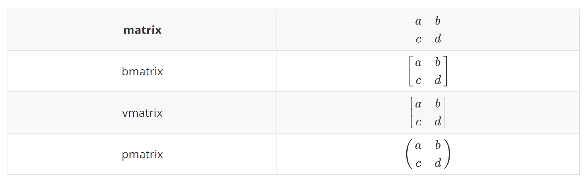

# latex公式语法
<!-- TOC -->

- [latex公式语法](#latex%E5%85%AC%E5%BC%8F%E8%AF%AD%E6%B3%95)
  - [1. 简介](#1-%E7%AE%80%E4%BB%8B)
  - [2. 数学模式](#2-%E6%95%B0%E5%AD%A6%E6%A8%A1%E5%BC%8F)
    - [2.1. 行内公式](#21-%E8%A1%8C%E5%86%85%E5%85%AC%E5%BC%8F)
    - [2.2. 行间公式](#22-%E8%A1%8C%E9%97%B4%E5%85%AC%E5%BC%8F)
    - [2.3. 手动编号](#23-%E6%89%8B%E5%8A%A8%E7%BC%96%E5%8F%B7)
  - [3. 数学结构](#3-%E6%95%B0%E5%AD%A6%E7%BB%93%E6%9E%84)
    - [3.1. 简单运算](#31-%E7%AE%80%E5%8D%95%E8%BF%90%E7%AE%97)
    - [3.2. 上下标](#32-%E4%B8%8A%E4%B8%8B%E6%A0%87)
    - [3.3. 根号与分式](#33-%E6%A0%B9%E5%8F%B7%E4%B8%8E%E5%88%86%E5%BC%8F)
    - [3.4. 向量与上下标记](#34-%E5%90%91%E9%87%8F%E4%B8%8E%E4%B8%8A%E4%B8%8B%E6%A0%87%E8%AE%B0)
    - [3.5. 积分、极限、求和与乘积](#35-%E7%A7%AF%E5%88%86%E6%9E%81%E9%99%90%E6%B1%82%E5%92%8C%E4%B8%8E%E4%B9%98%E7%A7%AF)
    - [3.6. 三圆点](#36-%E4%B8%89%E5%9C%86%E7%82%B9)
    - [3.7. 重音符号](#37-%E9%87%8D%E9%9F%B3%E7%AC%A6%E5%8F%B7)
    - [3.8. 矩阵](#38-%E7%9F%A9%E9%98%B5)
  - [4. 多行公式](#4-%E5%A4%9A%E8%A1%8C%E5%85%AC%E5%BC%8F)
    - [4.1. 公式组合](#41-%E5%85%AC%E5%BC%8F%E7%BB%84%E5%90%88)
    - [4.2. 拆分单个公式](#42-%E6%8B%86%E5%88%86%E5%8D%95%E4%B8%AA%E5%85%AC%E5%BC%8F)
  - [5. 附录](#5-%E9%99%84%E5%BD%95)
    - [5.1. 二元运算符](#51-%E4%BA%8C%E5%85%83%E8%BF%90%E7%AE%97%E7%AC%A6)
    - [5.2. 二元关系运算符](#52-%E4%BA%8C%E5%85%83%E5%85%B3%E7%B3%BB%E8%BF%90%E7%AE%97%E7%AC%A6)
    - [5.3. 重音符](#53-%E9%87%8D%E9%9F%B3%E7%AC%A6)
    - [5.4. 定界符](#54-%E5%AE%9A%E7%95%8C%E7%AC%A6)
    - [5.5. 希腊字母](#55-%E5%B8%8C%E8%85%8A%E5%AD%97%E6%AF%8D)
    - [5.6. 箭头](#56-%E7%AE%AD%E5%A4%B4)
    - [5.7. 其他符号](#57-%E5%85%B6%E4%BB%96%E7%AC%A6%E5%8F%B7)

<!-- /TOC -->

## 1. 简介

**LaTeX**，作为广义上的计算机标记语言（比如HTML），它继承了计算机语言的光荣传统，通过一些简单的代码表达出精确的含义，具有不二义性。其文章排版的结果可以完全按照你的想法来，不仅解决了玄学问题，渲染出来的文章优美；同时，其还可以通过简单的语法写出优雅高贵的数学公式，目前Markdown也已经支持LaTeX语法的公式。

在线编辑 *LaTex* 公式的网站推荐：<https://www.latexlive.com/>

## 2. 数学模式

在 *LaTeX* 数学模式中，公式有两种形式——行内公式和行间公式。前者公式嵌入在行内，适用于简单短小的公式；后者居中独占一行，适用于比较长或重要的公式。公式中的空格均会被忽略，可以使用命令 `\quad` 或`\qquad` 实现。

> 在行间公式中，命令 `\tag{n}` 可以进行手动编号

### 2.1. 行内公式

通过两个 `$` 符标记公式代码，代码格式如下：

```latex
 $f(x) = a + b $
```

渲染效果如下：


### 2.2. 行间公式

通过两个 `$$` 标记公式代码，代码格式如下：

```latex
$$ f(x) = a + b $$
```


### 2.3. 手动编号

在行间公式中，可以通过关键字 `\tag{n}` 来进行手动编号，样例如下：

```latex
 $f(x) = a - b \tag{1.1}$
```

渲染效果如下：


## 3. 数学结构

### 3.1. 简单运算

拉丁字母、阿拉伯数字和 `+ - * / =` 运算符均可以直接输入获得。其他运算符需要用 *LaTex* 语法关键字来表示：

- `\cdot`: 表示圆点乘法
- `\neq`: 表示不等号
- `\equiv`: 表示恒等号
- `\bmod`: 表示取模

样例1：

```latex
 $x+2-3*4/6=4/y + x\cdot y$
```

渲染效果如下：


样例2：

```latex
 $0 \neq 1 \quad x \equiv x \quad 1 = 9 \bmod 2$
```

渲染效果如下：


> 所有二元运算符的语法关键字详见 [附录：二元运算符](#51-%E4%BA%8C%E5%85%83%E8%BF%90%E7%AE%97%E7%AC%A6)

### 3.2. 上下标

语法 `_` 表示下标，`^` 表示上标；上下标的内容不止一个字符时，需要用大括号括起来。单引号 `'` 表示求导。

样例1：

```latex
 $a_{ij}^{2} + b^3_{2}=x^{t} + y' + x''_{12}$
```

渲染效果如下：


### 3.3. 根号与分式

语法 `\sqrt` 表示平方根，`\sqrt[n]` 表示n次方根；`\frac` 表示分式。

样例1：

```latex
 $\sqrt{x} + \sqrt{x^{2}+\sqrt{y}} = \sqrt[3]{k_{i}} - \frac{x}{m}$
```

渲染效果如下：


### 3.4. 向量与上下标记

向量的表示方法：

- `\vec`: 表示向量
- `\overrightarrow`: 表示箭头向右的向量
- `\overleftarrow`: 表示箭头向左的向量

样例1：

```latex
 $\vec{a} + \overrightarrow{AB} + \overleftarrow{DE}$
```

渲染效果如下：


> 所有与箭头相关的的语法关键字详见 [附录：箭头](#56-%E7%AE%AD%E5%A4%B4)

一些常用的上下标记的语法：

- `\overline`、`\underline`: 分别在表达式上、下画出水平线
- `\overbrace`、`\underbrace`: 分别在表达式的上、下画出水平的大括号

样例2：

```latex
 $\overline{x+y} \qquad \underline{a+b}$
```

渲染效果如下：


样例3：

```latex
 $\overbrace{1+2+\cdots+n}^{n个} \qquad \underbrace{a+b+\cdots+z}_{26}$
```

渲染效果如下：


### 3.5. 积分、极限、求和与乘积

表示的语法如下：

- `\int`: 表示积分
- `\lim`: 表示极限
- `\sum`: 表示求和
- `\prod`: 表示乘积

样例1：

```latex
 $\lim_{x \to \infty} x^2_{22} - \int_{1}^{5}x\mathrm{d}x + \sum_{n=1}^{20} n^{2} = \prod_{j=1}^{3} y_{j}  + \lim_{x \to -2} \frac{x-2}{x}$
```

渲染效果如下：


### 3.6. 三圆点

表示语法如下：

- `\ldots`: 表示位于基线上的三个圆点
- `\cdots`: 表示居中的三个圆点
- `\vdots`: 表示垂直的三个圆点
- `\ddots`: 表示对角线排列的三个圆点

样例1：

```latex
 $x_{1},x_{2},\ldots,x_{5}  \quad x_{1} + x_{2} + \cdots + x_{n}$
```

渲染效果如下：


> 所有与三圆点相关的的语法关键字详见 [附录：其他符号](#57-%E5%85%B6%E4%BB%96%E7%AC%A6%E5%8F%B7)

### 3.7. 重音符号

样例1：

```latex
 $\hat{x}$
```

渲染效果如下：


> 所有与重音符相关的的语法关键字详见 [附录：重音符](#53-%E9%87%8D%E9%9F%B3%E7%AC%A6)

### 3.8. 矩阵

表示语法如下：



样例1（其中 `&` 用于分割列；`\\` 用于分割行）：

```latex
$\begin{bmatrix}
1 & 2 & \cdots \\
67 & 95 & \cdots \\
\vdots  & \vdots & \ddots \\
\end{bmatrix}$
```

渲染效果如下：


## 4. 多行公式

### 4.1. 公式组合

通过 *cases* 环境实现公式的组合，`&` 分隔公式和条件。

样例如下：

```latex
$D(x) = \begin{cases}
\lim\limits_{x \to 0} \frac{a^x}{b+c}, & x<3 \\
\pi, & x=3 \\
\int_a^{3b}x_{ij}+e^2 \mathrm{d}x,& x>3 \\
\end{cases}$
```

渲染效果如下：


### 4.2. 拆分单个公式

通过 *split* 环境实现公式拆分

样例如下：

```latex
$\begin{split}
\cos 2x &= \cos^2x - \sin^2x \\
&=2\cos^2x-1
\end{split}$
```

渲染效果如下：


## 5. 附录

### 5.1. 二元运算符


AMS二元运算符：


### 5.2. 二元关系运算符

普通的二元关系运算符：


AMS二元关系符：


AMS二元否定关系符：


### 5.3. 重音符


### 5.4. 定界符

普通定界符：


AMS定界符：


### 5.5. 希腊字母


AMS希腊和希伯来字母：


### 5.6. 箭头

普通的箭头：


AMS箭头：


### 5.7. 其他符号


AMS其他符号：


