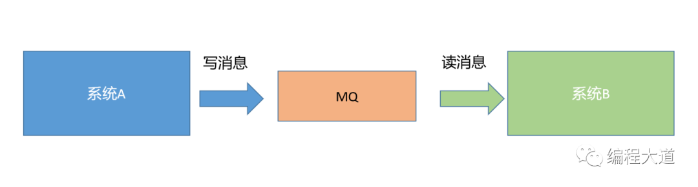
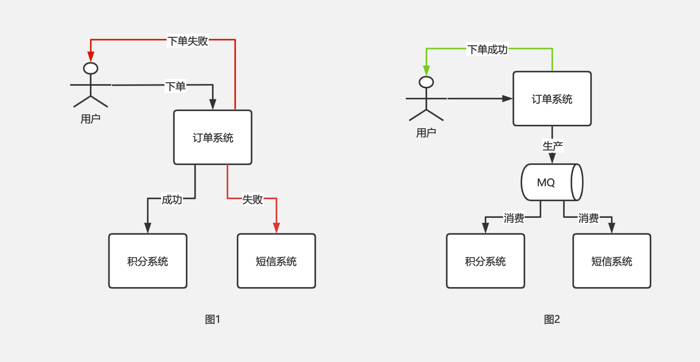
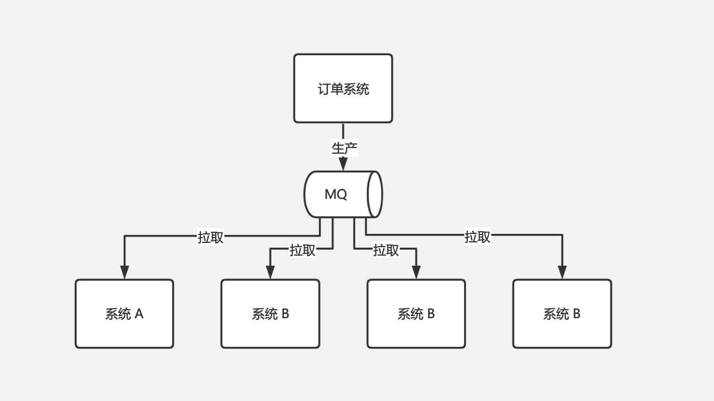
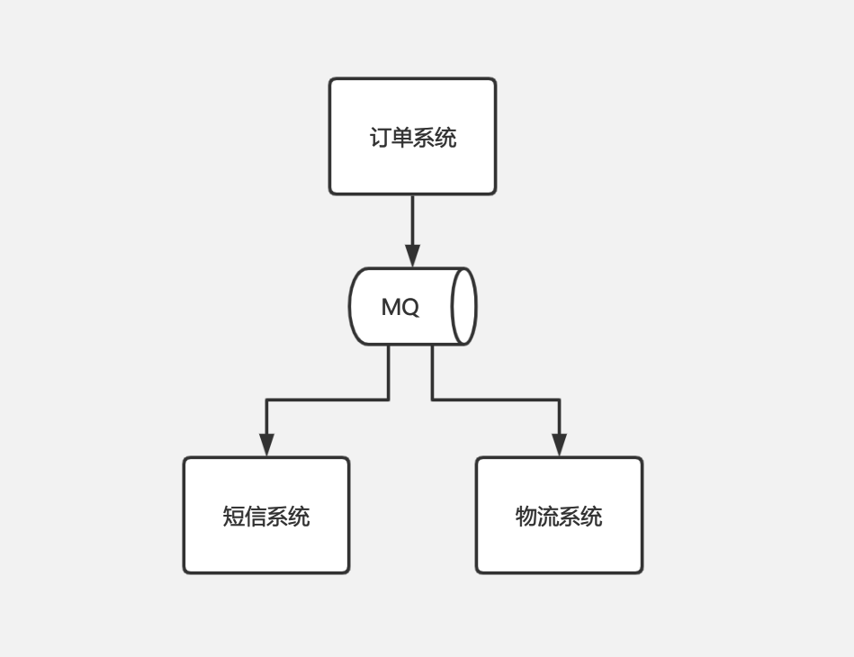
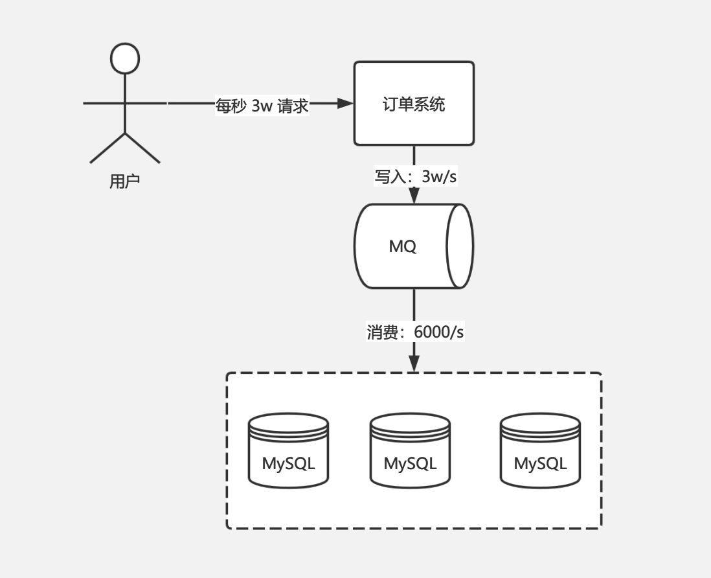
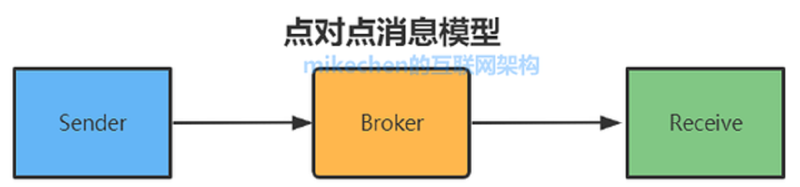
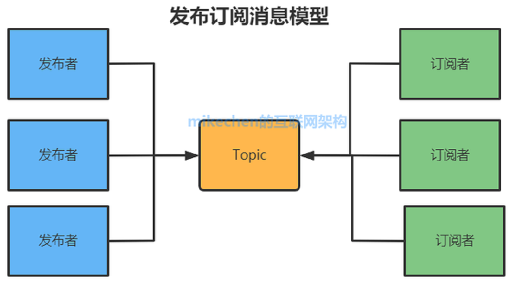

# 什么是消息队列

<!-- TOC -->

- [什么是消息队列](#%E4%BB%80%E4%B9%88%E6%98%AF%E6%B6%88%E6%81%AF%E9%98%9F%E5%88%97)
  - [1. 消息队列概述](#1-%E6%B6%88%E6%81%AF%E9%98%9F%E5%88%97%E6%A6%82%E8%BF%B0)
  - [2. 为什么要使用消息队列](#2-%E4%B8%BA%E4%BB%80%E4%B9%88%E8%A6%81%E4%BD%BF%E7%94%A8%E6%B6%88%E6%81%AF%E9%98%9F%E5%88%97)
    - [2.1. 应用耦合（解耦）](#21-%E5%BA%94%E7%94%A8%E8%80%A6%E5%90%88%E8%A7%A3%E8%80%A6)
    - [2.2. 异步处理](#22-%E5%BC%82%E6%AD%A5%E5%A4%84%E7%90%86)
    - [2.3. 流量削峰](#23-%E6%B5%81%E9%87%8F%E5%89%8A%E5%B3%B0)
  - [3. 消息队列的两种模型](#3-%E6%B6%88%E6%81%AF%E9%98%9F%E5%88%97%E7%9A%84%E4%B8%A4%E7%A7%8D%E6%A8%A1%E5%9E%8B)
    - [3.1. 点对点模型](#31-%E7%82%B9%E5%AF%B9%E7%82%B9%E6%A8%A1%E5%9E%8B)
    - [3.2. 发布订阅模型](#32-%E5%8F%91%E5%B8%83%E8%AE%A2%E9%98%85%E6%A8%A1%E5%9E%8B)
  - [4. 消息队列引入的常见问题以及解决办法](#4-%E6%B6%88%E6%81%AF%E9%98%9F%E5%88%97%E5%BC%95%E5%85%A5%E7%9A%84%E5%B8%B8%E8%A7%81%E9%97%AE%E9%A2%98%E4%BB%A5%E5%8F%8A%E8%A7%A3%E5%86%B3%E5%8A%9E%E6%B3%95)
    - [4.1. 消息重复消费问题（幂等性）](#41-%E6%B6%88%E6%81%AF%E9%87%8D%E5%A4%8D%E6%B6%88%E8%B4%B9%E9%97%AE%E9%A2%98%E5%B9%82%E7%AD%89%E6%80%A7)
    - [4.2. 消息队列消息丢失问题](#42-%E6%B6%88%E6%81%AF%E9%98%9F%E5%88%97%E6%B6%88%E6%81%AF%E4%B8%A2%E5%A4%B1%E9%97%AE%E9%A2%98)
    - [4.3. 消息队列的顺序消费问题](#43-%E6%B6%88%E6%81%AF%E9%98%9F%E5%88%97%E7%9A%84%E9%A1%BA%E5%BA%8F%E6%B6%88%E8%B4%B9%E9%97%AE%E9%A2%98)
    - [4.4. 消息队列的高可用问题](#44-%E6%B6%88%E6%81%AF%E9%98%9F%E5%88%97%E7%9A%84%E9%AB%98%E5%8F%AF%E7%94%A8%E9%97%AE%E9%A2%98)
    - [4.5. 消息队列的数据一致性问题](#45-%E6%B6%88%E6%81%AF%E9%98%9F%E5%88%97%E7%9A%84%E6%95%B0%E6%8D%AE%E4%B8%80%E8%87%B4%E6%80%A7%E9%97%AE%E9%A2%98)
    - [4.6. 如何处理消息队列大量消息积压](#46-%E5%A6%82%E4%BD%95%E5%A4%84%E7%90%86%E6%B6%88%E6%81%AF%E9%98%9F%E5%88%97%E5%A4%A7%E9%87%8F%E6%B6%88%E6%81%AF%E7%A7%AF%E5%8E%8B)
  - [5. 常用的消息队列](#5-%E5%B8%B8%E7%94%A8%E7%9A%84%E6%B6%88%E6%81%AF%E9%98%9F%E5%88%97)

<!-- /TOC -->

## 1. 消息队列概述

**消息队列（Message Queue，简称 MQ）**，是作为单独的中间件产品存在的，独立部署的，保存消息的一个容器，本质上是个队列。它是分布式系统中的重要组件。

## 2. 为什么要使用消息队列

消息队列的产生，主要是为了解决以下几个问题：

- **应用耦合（解耦）**
- **异步处理**
- **流量削峰**

### 2.1. 应用耦合（解耦）

应用解耦场景一：比如订单系统，下单后需要调配送系统通知发货、调积分系统增加积分等。正常情况下，需要在下单完成后手动写代码调用这些接口，如果某个系统调用失败，则下单失败。这时这些系统是耦合在一起的，其中一个系统出故障，会导致整个下单失败。

如果引入 MQ，下单后，把数据推送到 MQ 中，由配送系统、短信系统自己拉取数据进行消费，这时订单系统和配送系统、短信系统就解耦开了，这两个系统的故障也不会影响到下单的过程，下单后直接给用户返回下单成功。如下图 1、图 2 分别为解耦前后的情况。

解耦场景 2：还是订单系统，用户下单后，需要推送订单数据给其他部门系统（如大数据部门）做一些如统计分析类的工作。正常情况下也是需要再下单完成之后，给其他系统推送订单数据，这也会有一些问题，比如大数据部门需要增删传输的数据字段、其他部门也需要这个订单数据、某个部门突然又不需要这些数据了，这些操作都需要修改代码才能实现，就跟其他系统耦合在一起了。

引入 MQ 后，就不在需要订单系统主动调其他系统的接口推送数据了，订单系统只需要把数据推送到 MQ 中，其他哪些部门哪些系统需要订单数据，自己编写代码去 MQ 拉取即可。如下图：

### 2.2. 异步处理

**消息队列的主要特点是异步处理，主要目的是减少请求响应时间，实现非核心流程异步化，提高系统响应性能。**

不知道大家有没有调用过第三方的系统，有过经验的童鞋都知道，说起第三方系统脑海里想到的一个字就是：坑！你永远不知道它啥时候就挂了，也不知道啥时候响应就会慢得跟蜗牛一样，稳定性实在是不好吐槽，五味杂陈啊。

就好像订单系统，你的短信发送功能是第三方短信系统提供的，发货功能是第三方物流系统提供的。当接口故障的时候你需要自己编写复杂的重试逻辑，不管你是同步还是异步调用；重试失败后还要把数据持久化下来，用定时任务在未来某个时间重新推送，因为可能只是当时人家系统刚好不可用了，过个半小时一小时系统恢复了，那你还是需要重新推送的。这一整个逻辑是会复杂，还会影响性能。

如果引入 MQ，那么我们只需把消息推送到 MQ 中，再从 MQ 中消费即可。如果接口不可用，直接给 MQ 返回消费失败，下次还可以重新拉取消息进行消费，不再需要手动编写复杂的重试代码等。如下图

**所以异步的典型场景就是将比较耗时而且不需要即时（同步）返回结果的操作，通过消息队列来实现异步化。**

### 2.3. 流量削峰

多数情况下，系统的瓶颈都会在数据库，假设数据库每秒可以支撑 6000 个请求，在一些如秒杀、双十一等高峰期场景中，每秒的请求达到了 3W，那么这时数据库是扛不住这么高的并发的，而 MQ 一般抗住几万的并发没有任何问题。

这时我们就可以引入 MQ，请求到达后先写入 MQ 中，再从 MQ 中慢慢消费消息落库，此时写入 MQ 的请求仍然是每秒 3W，但是从 MQ 消费的消息控制在每秒 6000，积压的请求可以在后面空闲期慢慢消费完成。这样，每秒 3W 的请求也可以扛下来，如下图

**这就是削峰，将某一段时间的超高流量分摊到更长的一段时间内去消化，避免了流量洪峰击垮系统。**

## 3. 消息队列的两种模型

### 3.1. 点对点模型

消息队列的点对点模型(Point to Point, P2P模型)包含以下三种角色：

- 消息队列（Message Queue）
- 发送者（Sender）/生产者
- 接收者（Receiver）/消费者（Consumer）

每个消息都被发送到一个**特定的队列**，接收者从队列中获取消息。队列保留着消息，可以放在 内存 中也可以 持久化，直到他们被消费或超时。

**特点**：

- 每个消息只有一个消费者（Consumer）(即一旦被消费，消息就不再在消息队列中)
- 生产者和消费者之间在时间上没有依赖性，生产者发送消息之后，不管有没有消费者在运行，都不会影响到生产者下次发送消息
- 消费者在成功接收消息之后需向队列应答成功，以便消息队列删除当前接收的消息。

即：生产者发送一条消息到 queue，一个 queue 可以有很多消费者，**但是一个消息只能被一个消费者接受**，当没有消费者可用时，这个消息会被保存直到有一个可用的消费者，所以Queue实现了一个可靠的负载均衡。

### 3.2. 发布订阅模型

发布订阅模型包含以下三种角色：

1. 主题（Topic）
2. 发布者（Publisher）
3. 订阅者（Subscriber）

多个发布者将消息发送到 Topic，系统将这些消息传递给多个订阅者。

**特点**：

- 每个消息可以有多个订阅者
- 发布者和订阅者之间有时间上的依赖性。针对某个主题（Topic）的订阅者，它必须创建一个订阅者之后，才能消费发布者的消息。
- 为了消费消息，订阅者需要提前订阅该角色主题，并保持在线运行；

## 4. 消息队列引入的常见问题以及解决办法

引入消息队列后，会给整个系统带来以下不良的影响：

1. 增加了系统的复杂性：在使用过程中需要考虑：**重复消费**、**消息丢失**、**消息的顺序消费**等问题
2. 可能引入数据一致性问题：如：多个系统依赖一个系统发送的消息，如果部分系统消费成功而部分系统消费失败，可能会导致数据不一致的问题。（可以通过分布式事务来解决，什么是分布式事务？）
3. 降低了系统的可用性：各个系统之间强依赖 MQ，MQ 的可用性就变得非常的关键，因此需要额外的去保证 MQ 的高可用，如果 MQ 出现异常，就会造成整个系统异常。

### 4.1. 消息重复消费问题（幂等性）

to be continue...

参考链接：

- [消息重复消费问题（幂等性）](https://blog.csdn.net/qq_41864967/article/details/90442085)
- [如何保证消息不被重复消费](https://xie.infoq.cn/article/72f1f64f7bca1b55d9934666b)

### 4.2. 消息队列消息丢失问题

to be continue...

参考链接：[如何处理消息丢失问题](https://xie.infoq.cn/article/b2548617f42117436afca7f4d)

### 4.3. 消息队列的顺序消费问题

to be continue...

参考链接：[如何保证消息的顺序性](https://xie.infoq.cn/article/c84491a814f99c7b9965732b1)

### 4.4. 消息队列的高可用问题

to be continue...

参考链接：[如何保证消息队列的高可用](https://xie.infoq.cn/article/b73758f12905a71b1efe1b4d2)

### 4.5. 消息队列的数据一致性问题

to be continue...

参考链接：[如何保证消息队列的数据一致性问题](https://zhuanlan.zhihu.com/p/386469732)

> 什么是分布式事务？

### 4.6. 如何处理消息队列大量消息积压

to be continue...

参考链接：[如何处理消息队列大量消息积压](https://zhuanlan.zhihu.com/p/168752490)

## 5. 常用的消息队列

目前比较流行的消息队列中间件有：*ActiveMQ*、*RabbitMQ*、*RocketMQ*、*Kafka*、*RMQ*等

to be continue...

详见：

- [消息队列：从选型到原理](https://mp.weixin.qq.com/s/Gb9k_LxQhOPDcMGxDJ9Jvw)
- [RMQ——支持合并和优先级的消息队列](https://developer.aliyun.com/article/780217)

[//]:参考资料
[//]:https://mp.weixin.qq.com/s/Gb9k_LxQhOPDcMGxDJ9Jvw
[//]:https://www.cnblogs.com/javalyy/p/8856731.html
[//]:https://baijiahao.baidu.com/s?id=1715945634773884801
[//]:https://xie.infoq.cn/article/84f9538c7468ed89434c68686
